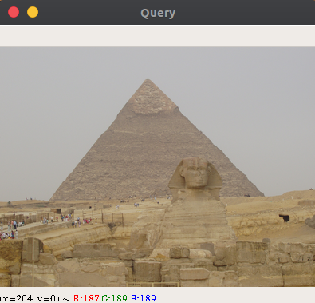
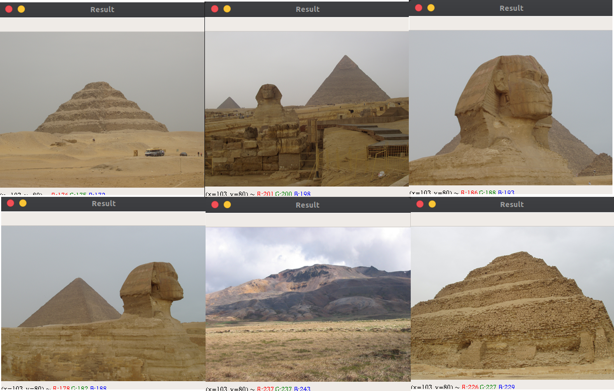

# Image Finder
A simple image finder (image search engine) built from the concept of CBIR (Content-Based Image Retrieval) systems.


## Installation the Application:
**1. Clone the Repository**

```bash
   $ git clone git@github.com:FredDoe/image-finder.git
   $ cd image-finder
```

**2. Create a virtual environment with Python module `venv` and activate it**

```
[Windows]
python -m venv venv
.\venv\Scripts\activate


[Linux/macOS] 
python3 -m venv venv
source venv/bin/activate
```

**3. Install Dependencies**

```
[Windows]
pip install -r requirements.txt

[Linux/macOS]
pip3 install -r requirements.txt
```

## Using the Finder :computer::mag_right: 
* You need a dataset of images to work on. Populate the dataset folder with images. A sample dataset can be obtained from <a href="http://lear.inrialpes.fr/people/jegou/data.php">INRIA Holidays Dataset.</a>

* You need to index the sample dataset. Run the following command in a terminal opened into the project directory:

```
[Windows]
python index.py --dataset dataset --index index.csv

[Linux/macOS]
python3 index.py --dataset dataset --index index.csv
```

* To perform search on the dataset, execute this command:
```
[Windows]
python search.py --index index.csv --query <path-to-image-search-query> --result-path dataset

Example: python search.py --index index.csv --query queries/123600.jpg --result-path dataset


[Linux/macOS]
python3 search.py --index index.csv --query <path-to-image-search-query> --result-path dataset

Example: python3 search.py --index index.csv --query queries/123600.jpg --result-path dataset
```

## Demo :movie_camera:
   Search results from query:
   
   
   

## Reference :book:
<a href="https://en.wikipedia.org/wiki/Content-based_image_retrieval">Content-Based Image Retrieval (CBIR)</a>
